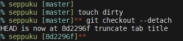

# Seppuku zsh theme

## Custom theme for [zsh](https://www.zsh.org), inspired by [cloud](https://github.com/robbyrussell/oh-my-zsh/blob/master/themes/cloud.zsh-theme)
* Clean
* Lean
* Fast
* Minimal

## Screenshots

## Requirements
* zsh >= `4.3.9`
* oh-my-zsh
* git >= `2.10.0`

## Installation
* To install: `make install`
* To uninstall: `make uninstall`

You may have to exit and re-launch zsh after these commands if it is already running.
